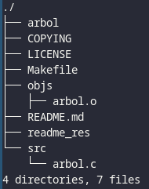

# arbol

arbol list contents of directories in a tree-like format, written using C.



## Requirements

- Unix like system
- GCC
- GNU make
- utf8 support.

## Compiling, running and cleaning.
```sh
make                #
make run            # ./arbol
make clean          # rm arbol objs/arbol.o
```
## Options
press [SPACE] or [ENTER] to pause the frame.

- `-h,   --help                 → show this help message and exit`
- `-v,   --version              → show program's version number and exit`
- `-a,   --all                  → all files are printed. By default arbol does not
                                    print hidden files (those beginning with a dot
                                    '.'). In no event does arbol print the file
                                    system constructs '.' (current directory) and
                                    '..' (previous directory).`
- `-L,   --max_level=NUM        → max display depth of the directory tree.`
- `-t,   --tabsize=NUM          → number of character used at each indentation
                                    level, if size <= 1 no character are printed.`
## Notes
- Max level depth is 65535 levels.
- No colors
- Infinity recursion if file has symlink to parent directory, e.g:
/lib/llvm-14/build/Debug+Asserts/ (prob, I will fix on future)

## Made by [Sivefunc](https://gitlab.com/sivefunc)
## Licensed under [GPLv3](LICENSE)
